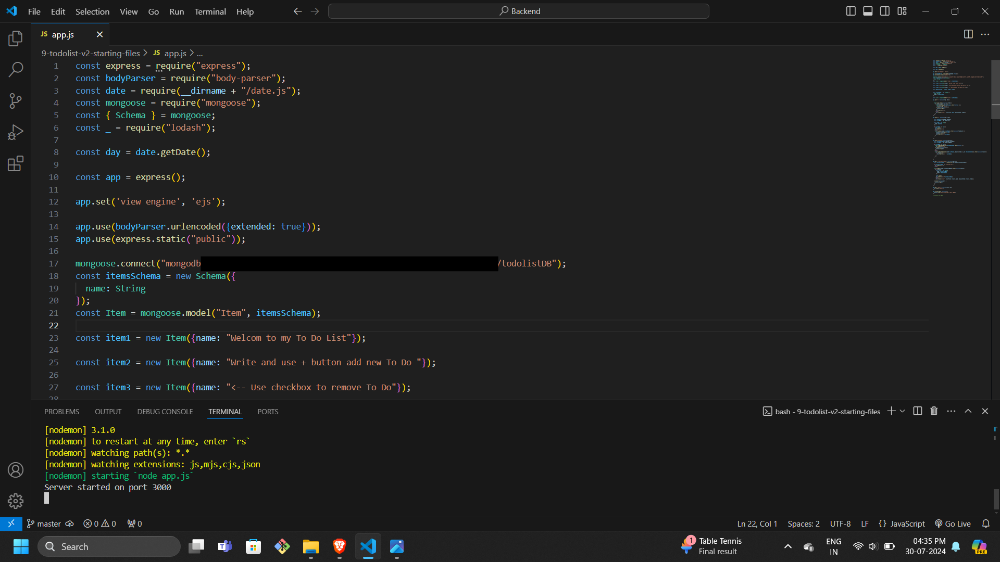
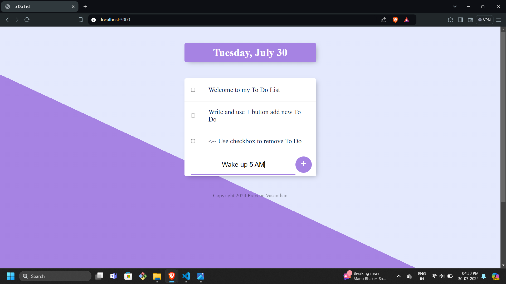
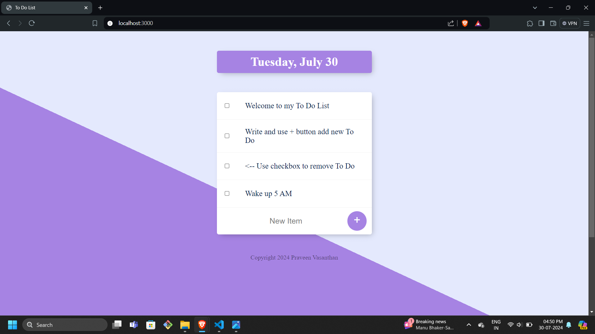
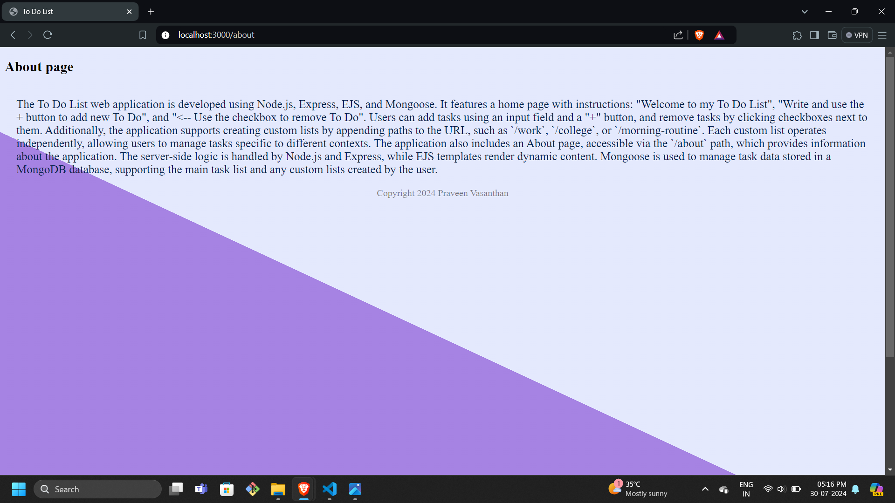
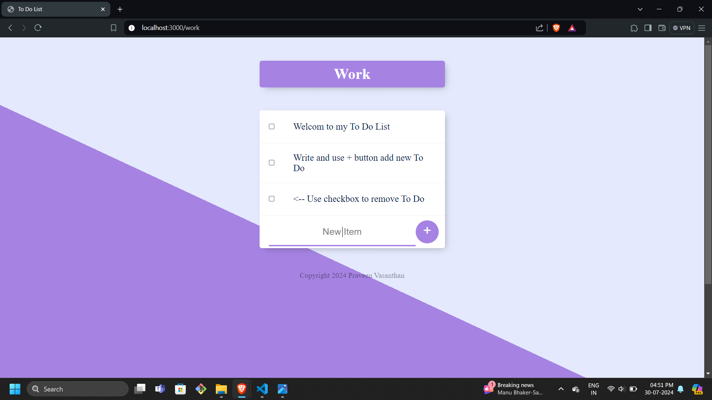

# To Do List Web Page

A dynamic To Do List web application built using Node.js, Express, EJS, and Mongoose. This application allows users to add and remove tasks, create custom lists, and view an About page.

## Features

- Home page with instructions
- Add new tasks using the input field and "+" button
- Remove tasks using checkboxes
- Create custom lists by adding a path in the URL (e.g., /work, /college, /morning-routine)
- About page accessible via the /about path

## Installation

1. Clone the repository:
    ```bash
    git clone https://github.com/vasanth165/todo-list.git
    ```
2. Navigate to the project directory:
    ```bash
    cd todo-list
    ```
3. Install dependencies:
    ```bash
    npm install
    ```
4. Start the server using nodemon:
    ```bash
    nodemon app.js
    ```

## Usage

1. Open your web browser and go to `http://localhost:3000`
2. Follow the instructions on the home page to add and remove tasks
3. To create a custom list, add the desired list name to the URL (e.g., `http://localhost:3000/work`)
4. Visit the About page by going to `http://localhost:3000/about`

## Screenshots

### 1. Running Nodemon


### 2. Home Page


### 3. Added Content


### 4. About Page


### 5. Custom List

